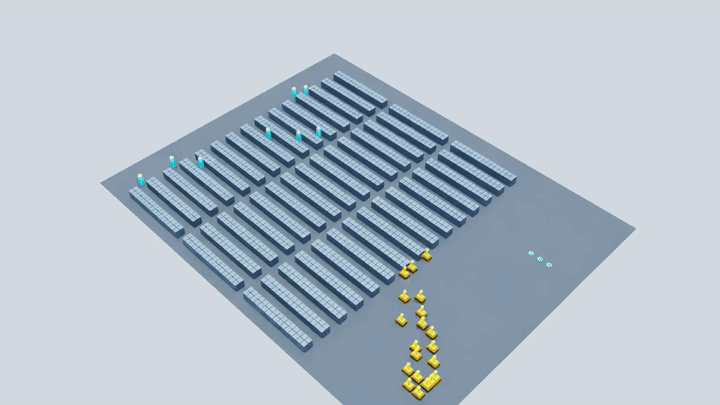
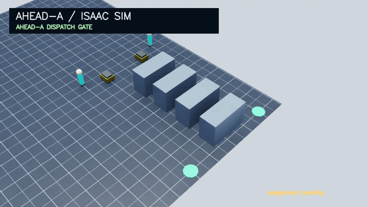

# AHEAD Order Picking

Executable research code for **anticipatory human dispatch and demand-aware staging in collaborative order-picking systems**. AHEAD is implemented inside the same RWARE event loop that produces robot arrivals, worker travel, service, and queueing—it is not a detached formula-only reimplementation.

The public artifact exposes two complementary mechanisms:

- **AHEAD-A — early assignment:** assign an idle picker to an en-route robot before the robot parks at its rack;
- **AHEAD-D — demand-aware staging:** move an unassigned picker toward observable near-term rack demand without committing that picker to a request.

Arrival uncertainty is represented by Q50/Q90 duration estimates. Static, rolling-quantile, CatBoost median, CatBoost multi-quantile, and oracle backends share one interface.

## Canonical Site-A experiment environment



This shared environment demo mirrors the canonical comparison setup: Site-A batched orders, Batch-Random sequencing, 8 human pickers, 20 robots, and the AHEAD `rv_static` policy. Motion comes from the real RWARE event loop through its ZMQ bridge and is rendered by an Isaac Sim/Isaac Lab `Camera` at a fixed 45-degree downward angle. Isaac only interpolates adjacent source ticks. The operational orders, facility trace, and layout data are not included in this public repository.

## Isaac Sim rollout



The looping GIF is derived from RGB captured by an actual Isaac Sim/Isaac Lab `Camera` on a procedural USD warehouse stage. It executes this repository's `rv_static` rendezvous cost matrix and Bertsekas solver. En-route robots become eligible before parking, so robots and pickers travel concurrently toward their rendezvous targets. The title/status overlay is applied to the captured Isaac RGB frames.

```bash
REPO="$PWD"
cd /path/to/IsaacLab
PYTHONPATH="$REPO:$PWD/source/isaaclab:$PWD/source/isaaclab_assets:$PWD/source/isaaclab_tasks" \
  ./isaaclab.sh -p "$REPO/scripts/render_isaac_warehouse.py" \
  --method ahead --headless --enable_cameras --device cuda:0 \
  --output "$REPO/media/ahead_isaac_sim.mp4" \
  --poster "$REPO/media/ahead_isaac_sim.png"
```

The machine-readable run receipt is [`media/ahead_isaac_sim.json`](media/ahead_isaac_sim.json). This is a qualitative synthetic-layout demonstration, not a private-facility throughput experiment.

## What you can run

After cloning, you can:

1. execute the real rolling arrival-risk model on a deterministic synthetic trace;
2. inspect every registered early-assignment strategy;
3. evaluate the actual staging score used by the simulator;
4. run asset-free behavior tests for estimator separation, quantile behavior, assignment, map DSL, and movement enforcement.

## Quick start

Python 3.10–3.13 is supported.

```bash
git clone https://github.com/Godpa-juke/ahead-order-picking.git
cd ahead-order-picking
python -m venv .venv
source .venv/bin/activate
python -m pip install -e '.[dev]'
python scripts/run_synthetic_ahead.py
pytest
```

For the CatBoost backend:

```bash
python -m pip install -e '.[dev,learning]'
```

The default synthetic example uses the dependency-free rolling-quantile backend, so it runs without CatBoost or private warehouse data.

## System design

### AHEAD-A: early rendezvous assignment

A robot in `ROBOT_MOVESPOT` already exposes its destination rack. AHEAD-A admits that en-route robot to the assignment candidate set and evaluates a rendezvous cost using:

- picker travel time to the target rack;
- robot arrival Q50;
- robot-arrival uncertainty `Q90 - Q50`;
- early-picker idle time at the rack;
- robot late-wait time;
- optional urgency/fairness terms inherited from the auction baseline.

The registered policy family includes static, Q50-only, risk-aware, real-time event-triggered, rolling-median, and oracle variants.

### AHEAD-D: demand-aware staging

An idle picker remains freely assignable but receives a temporary target near observable demand. Candidate targets come from parked or en-route robots. The learned score is:

```text
travel_distance
+ early_weight * max(0, ready_q50 - travel_distance)
+ uncertainty_weight * max(0, ready_q90 - ready_q50)
```

Unlike assignment, staging never reserves a robot/picker pair.

### Arrival-risk estimator

`ServiceRiskModel` returns `(Q50, Q90)` through one interface:

| Backend | Behavior |
|---|---|
| `static` | path/static estimate; no uncertainty spread |
| `rolling_median` | rolling empirical duration/static ratios |
| `catboost_median` | learned Q50 only; returns Q90 = Q50 |
| `catboost` | learned multi-quantile Q50/Q90 |
| `oracle` | upper-bound input supplied by the caller |

## Code map

| Path | Purpose |
|---|---|
| `rware/engine/human_assignment.py` | reverse-auction baseline and AHEAD-A rendezvous policies |
| `rware/engine/arrival.py` | feature collection, model lifecycle, prediction accounting |
| `rware/learning/risk_model.py` | Q50/Q90 estimator backends |
| `rware/engine/staging.py` | AHEAD-D target generation and staging score |
| `rware/engine/warehouse_engine.py` | simulator event-loop integration |
| `rware/engine/service_time.py` | deterministic/variable service-time scenarios |
| `scripts/run_synthetic_ahead.py` | deterministic no-data example |
| `scripts/render_isaac_warehouse.py` | actual Isaac Sim USD-stage rollout and Camera capture |
| `tests/test_iarl_validation.py` | model and consumer-separation contracts |

## Public reproducibility boundary

Included:

- executable RWARE simulator integration;
- AHEAD-A, AHEAD-D, arrival-risk, and auction baseline source;
- inline synthetic map and deterministic synthetic trace;
- behavioral tests;
- license, citation, and source provenance.

Not included:

- real warehouse orders or operational records;
- facility-specific maps and precomputed path arrays;
- trained models, raw experiment outputs, manuscripts, or internal paths.

The repository supports **algorithm reuse, policy extension, synthetic execution, and contract-level reproduction**. It does not claim that private-site throughput tables can be regenerated from the public inputs.

## Tests

```bash
pytest
```

The public suite checks runtime behavior, including:

- rolling and learned quantile semantics;
- separation of assignment and staging estimator backends;
- strategy registration;
- auction ablation relationships;
- map-overlay and movement enforcement on an inline synthetic warehouse.

## Extending AHEAD

- Add an arrival backend behind `ServiceRiskModel` while preserving `(Q50, Q90)` semantics.
- Add an early-assignment policy through `HumanAssignmentStrategy` and the strategy registry.
- Add a staging policy in `StagingPlanner`, keeping staging non-committal.
- Compare policies on the same distance and simulator event definitions; do not silently change the environment between baselines.

## Provenance and license

See [`PROVENANCE.md`](PROVENANCE.md) for the canonical export revision. This project is a modified derivative of RWARE. The upstream MIT copyright and license are preserved in [`LICENSE`](LICENSE).
